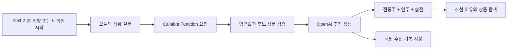
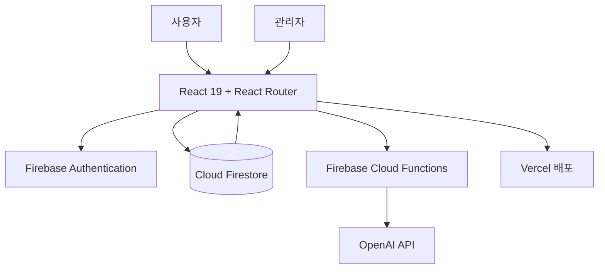

# JAJAK (자작)

<p align="center">
  
</p>

<p align="center"><strong>오늘의 기분과 취향에 어울리는 전통주 한 상을 제안합니다.</strong></p>

<p align="center">
  <a href="https://jajak-ten.vercel.app/">서비스 바로가기</a> ·
  <a href="https://github.com/jiwoo1012/TeamProject2">GitHub</a> ·
  <a href="https://app.notion.com/p/2-3ad117b757c9806dbe7cc4638a36a163?session_sync_attempted=1">프로젝트 문서</a>
</p>

JAJAK은 전통주가 낯선 사용자도 자신의 취향과 오늘의 상황에 맞는 술을 쉽게 고를 수 있도록 만든 **AI 주안상 큐레이션 쇼핑몰**입니다. 장기 취향과 당일의 기분·상황을 함께 반영해 전통주, 안주, 술잔을 하나의 주안상으로 추천하고 그 이유를 설명합니다.

브랜드 캐릭터 **막동이**가 취향 등록과 추천 과정을 안내하며, 상품 탐색부터 찜·장바구니·주문, 이벤트, 마이페이지까지 하나의 반응형 서비스 흐름으로 구현했습니다.

> 이 프로젝트는 KDT 과정에서 제작한 학습용 포트폴리오입니다. 실제 주류 판매, 본인인증, 결제는 이루어지지 않습니다.

## 프로젝트 정보

| 구분 | 내용 |
| --- | --- |
| 팀명 | 고주망태 |
| 교육기관 | [이젠컴퓨터아카데미 안산교육센터](https://as.ezenac.co.kr/index.asp) |
| 교육과정 | 생성형 AI 기반 UX/UI 디자인 & 프론트엔드 개발 과정 (ChatGPT, Illustrator, Photoshop, Figma, JavaScript, React) |
| 개발기간 | 2026.08.10 ~ 2026.09.09 |
| 발표일 | 2026.09.11 |
| 배포 | [https://jajak-ten.vercel.app/](https://jajak-ten.vercel.app/) |
| 프로젝트 문서 | [Notion 바로가기](https://app.notion.com/p/2-3ad117b757c9806dbe7cc4638a36a163?session_sync_attempted=1) (접근 권한 필요) |

## 기획 배경

전통주는 종류와 용어가 다양해 입문자가 맛을 예상하거나 자신에게 맞는 제품을 고르기 어렵습니다. 기존의 카테고리 중심 탐색만으로는 “오늘 혼자 가볍게 마시고 싶다”처럼 구체적인 상황까지 반영하기도 어렵습니다.

JAJAK은 다음 세 가지에 초점을 맞췄습니다.

- **입문 장벽 낮추기**: 복잡한 전문 용어보다 맛과 상황 중심의 질문으로 취향을 파악합니다.
- **상황까지 반영하기**: 평소 취향과 오늘의 기분, 인원, 음식, 분위기를 함께 고려합니다.
- **한 상으로 제안하기**: 술 한 병에 그치지 않고 어울리는 안주와 술잔, 추천 이유까지 제공합니다.

### 주요 사용자

- 전통주를 경험해 보고 싶지만 무엇을 골라야 할지 모르는 20~30대
- 퇴근 후 혼술이나 가벼운 홈술을 즐기는 직장인
- 자신의 취향에 맞는 새로운 술과 페어링을 발견하고 싶은 사용자

## 핵심 기능

| 영역 | 사용자 경험 | 구현 및 데이터 |
| --- | --- | --- |
| 회원·취향 | 이메일 회원가입·로그인, 가입 후 단계형 취향 등록 | Firebase Authentication, `users/{uid}.userPreference` |
| AI 큐레이션 | 회원·비회원 설문, 전통주·안주·술잔 추천과 추천 이유 제공 | Firebase Callable Functions, OpenAI API, 개발용 Mock 모드 |
| 상품 탐색 | 카테고리, 검색, 상세 필터, 정렬, 페이지네이션, 상품 상세 | Firestore 우선 조회, seed/reference 데이터 보완 |
| 찜·장바구니 | 찜 추가·삭제, 수량 및 선택 상품 관리 | Firestore wishlist, `jajak_cart` localStorage |
| 주문 | 배송지 선택·입력, 포인트 사용, 주문 저장과 주문 상세·취소 | Mock 결제, Firestore `orders` |
| 리뷰 | 구매 상품 리뷰 작성·수정·삭제, 관리자 노출·삭제 관리 | Firestore `reviews` collection |
| 이벤트 | 룰렛, 카드 짝 맞추기, OX 퀴즈, 중복 참여 방지와 결과 확인 | Firestore `events`, `eventParticipations` |
| 마이페이지 | 회원 요약, 프로필·배송지·포인트·주문·찜·AI·이벤트 내역 | Firebase 연동 |
| 고객센터 | 공지 목록·상세, FAQ 검색·분류, 1:1 문의 등록·조회 | Firestore `notices`, `inquiries` |
| 관리자 | 대시보드, 회원·상품·주문·이벤트·공지·리뷰 관리 | Firestore 연동, AI 로그는 시연 데이터 |

### AI 추천 흐름



- 회원은 저장된 기본 취향과 오늘의 응답을 함께 사용합니다.
- 비회원은 오늘의 응답만으로 간소화된 추천을 체험합니다.
- OpenAI Secret은 Firebase Functions에서 관리하며 프론트엔드에 노출하지 않습니다.
- 개발 환경에서는 `USE_MOCK_AI=true`로 외부 API 호출 없이 추천 흐름을 점검할 수 있습니다.

## 주요 화면과 경로

| 경로 | 화면 |
| --- | --- |
| `/`, `/intro` | 스플래시와 메인 |
| `/brand`, `/brand/makdong` | 브랜드·막동이 소개 |
| `/preference/*` | 회원 기본 취향 등록 |
| `/ai`, `/ai/survey`, `/ai/result` | AI 주안상 추천 |
| `/shop`, `/shop/:productId` | 상품 목록·상세 |
| `/events`, `/events/*` | 이벤트 목록·룰렛·OX 퀴즈·카드 게임 |
| `/cart`, `/checkout`, `/order-complete` | 장바구니·주문 |
| `/mypage/*` | 회원정보·배송지·포인트·주문·찜·활동 내역 |
| `/notices`, `/faq`, `/inquiry` | 고객센터 |
| `/admin/*` | 관리자 운영 화면 |

## 기술 스택

| 구분 | 기술 | 사용 목적 |
| --- | --- | --- |
| Frontend | React 19, JavaScript, JSX | 컴포넌트 기반 UI와 상태 관리 |
| Build | Vite 8 | 개발 서버와 프로덕션 번들 |
| Routing | React Router 7 | 사용자·마이페이지·관리자 화면 구성 |
| Styling | Sass, SCSS Modules | 페이지별 스타일 격리와 반응형 UI |
| Interaction | GSAP | 스플래시와 메인 스크롤 인터랙션 |
| Chart | Chart.js, react-chartjs-2 | 관리자 데이터 시각화 |
| Backend | Firebase Authentication, Cloud Firestore, Cloud Functions | 인증, 데이터 저장, 서버 함수 |
| AI | OpenAI API | 설문 기반 주안상 추천 생성 |
| Deploy | Vercel, Firebase | 프론트엔드 배포와 백엔드 서비스 |
| Quality | Oxlint, Vite build | 정적 검사와 프로덕션 빌드 검증 |

## 서비스 구조



### 주요 데이터 계약

- 상품의 Runtime 데이터는 Firestore `products`를 우선 사용하며, 저장소의 JSON은 seed/reference 및 보완 데이터로 사용합니다.
- 장바구니는 `localStorage`의 `jajak_cart`에 `[{ productId, quantity }]` 형태로 저장합니다.
- 주문에는 상품명, 가격, 이미지 등 주문 시점의 item snapshot을 보존합니다.
- 회원 정보는 `users/{uid}`, 배송지는 `users/{uid}/addresses`, 찜은 `users/{uid}/wishlist`에서 관리합니다.
- 이벤트 참여는 `eventParticipations/{eventId}_{uid}` 구조로 중복 참여를 방지합니다.
- 회원 권한은 `role: user | admin`, 상태는 `status: active | suspended`를 사용합니다.

세부 스키마와 협업 규칙은 [AGENTS.md](./AGENTS.md)에서 확인할 수 있습니다.

## 폴더 구조

```text
TeamProject2/
├─ functions/                 # Firebase Functions와 AI 추천 로직
├─ public/
├─ src/
│  ├─ assets/                 # 브랜드·캐릭터·상품 이미지와 영상
│  ├─ components/             # 공통·관리자·UI 컴포넌트
│  ├─ constants/              # 상태값과 설문 상수
│  ├─ data/                   # 상품 reference JSON과 이벤트 데이터
│  ├─ firebase/               # Auth·Firestore 공통 함수
│  ├─ hooks/                  # 공통 React hooks
│  ├─ pages/                  # 도메인별 페이지
│  ├─ routes/                 # 경로 상수와 접근 제어
│  ├─ services/               # 서비스 연결 로직
│  ├─ styles/                 # 전역 스타일과 디자인 토큰
│  └─ utils/                  # 장바구니·포맷·검증 유틸리티
├─ AGENTS.md                  # 팀 데이터 계약과 협업 규칙
├─ firestore.rules
└─ package.json
```

## 시작하기

### 1. 저장소 복제 및 설치

```bash
git clone https://github.com/jiwoo1012/TeamProject2.git
cd TeamProject2
npm install
```

### 2. 환경변수 설정

루트의 `.env.example`을 복사해 `.env.local`을 만들고 Firebase Web App 설정값을 입력합니다.

```env
VITE_FIREBASE_API_KEY=
VITE_FIREBASE_AUTH_DOMAIN=
VITE_FIREBASE_PROJECT_ID=
VITE_FIREBASE_STORAGE_BUCKET=
VITE_FIREBASE_MESSAGING_SENDER_ID=
VITE_FIREBASE_APP_ID=
```

OpenAI API Key는 프론트엔드 환경변수에 작성하지 않습니다. AI 연동 시 Firebase Functions Secret으로 관리합니다.

### 3. 실행 및 검증

```bash
npm run dev
npm run lint
npm run build
npm run preview
```

Firebase Functions를 로컬에서 실행하려면 `functions/`에서 별도로 의존성을 설치해야 하며, 해당 패키지는 Node.js 24 환경을 기준으로 합니다.

## 협업 방식

- `main`, `dev`에 직접 작업하지 않고 기능별 개인 브랜치에서 개발했습니다.
- 최신 `dev`를 개인 브랜치에 반영하고 Pull Request로 기능을 통합했습니다.
- Figma와 화면설계서를 기준으로 공통 색상, 타이포, 여백, 반응형 규칙을 맞췄습니다.
- 공통 컴포넌트와 Firebase 데이터 계약을 `AGENTS.md`에 기록해 중복 구현과 필드 불일치를 줄였습니다.
- 모바일 화면은 데스크톱을 단순 축소하지 않고 콘텐츠 순서와 배치를 다시 구성했습니다.
- 주요 통합 단계마다 `npm run lint`와 `npm run build`로 정적 검사와 빌드를 확인했습니다.

### 멘토링을 반영한 개선

- 복잡한 가입 단계 대신 **간편한 회원가입 후 단계형 취향 설문**으로 입력 부담을 나눴습니다.
- 기술의 복잡성보다 추천 경험과 UI 완성도에 집중하고, OpenAI API 기반 추천을 현재 구현 범위로 정했습니다.
- 사용자 유즈케이스를 먼저 정리한 뒤 화면설계와 모바일 흐름을 구체화했습니다.
- 이벤트 경험을 보강하기 위해 룰렛에 카드 짝 맞추기와 OX 퀴즈를 추가했습니다.
- 상품, 주문, 회원, 공지, 리뷰, 이벤트 영역을 Firestore와 연결했습니다.

## 트러블슈팅

| 문제 | 원인 | 해결 |
| --- | --- | --- |
| 로컬에서는 보이던 이미지가 Vercel에서 누락됨 | Windows와 Linux의 파일명 대소문자 처리 차이 | 실제 파일명과 import 경로의 대소문자를 일치시켜 배포 환경 오류 해결 |
| 초기 JavaScript 번들이 약 1.65MB로 생성됨 | 모든 페이지를 첫 진입 시 한 번에 불러옴 | `React.lazy`와 `Suspense`를 적용해 초기 청크를 당시 약 379KB까지 축소 |
| `INEFFECTIVE_DYNAMIC_IMPORT` 경고 발생 | 같은 모듈을 정적·동적으로 동시에 import | `cartStorage` import 방식을 정적으로 통일하고 필요한 방어 로직 유지 |
| Sass 색상 함수 경고 발생 | `lighten()`, `darken()` 사용 중단 예정 | `sass:color`의 `color.adjust()`로 교체 |
| Firebase 청크가 약 553KB로 유지됨 | 인증·Firestore SDK가 공통 흐름에서 함께 사용됨 | 번들 경고 기준을 600KB로 조정하고 초기 페이지 청크를 우선 최적화 |

## 팀 구성 및 역할

| 팀원 | 담당 영역 | 역할 |
| --- | --- | --- |
| 김지우 | 공통 UI·Routing<br>Preference·AI·통합 | Header·Footer·검색과 전체 Route 관리<br>기본 취향 설문과 회원·비회원 AI 큐레이션<br>Cloud Functions·OpenAI·추천 기록 연동<br>관리자 공통 UI와 Dashboard 데이터 집계<br>최종 페이지와 `dev` 통합본 점검 |
| 김태은 | 상품·상품 데이터<br>이벤트·운영 | 상품 Schema·seed/reference·Firestore 연동<br>상품 목록·상세·검색·필터·페어링·리뷰 협업<br>관리자 상품 CRUD와 재고·노출 관리<br>룰렛·카드 게임·OX 퀴즈 및 참여 제한·보상<br>이벤트 참여·당첨 내역과 관리자 이벤트 관리 |
| 백현정 | Main·Brand<br>Dashboard UI·Design | Splash·Journey·Hero·Best Seller와 GSAP 인터랙션<br>브랜드 스토리와 막동이 소개<br>관리자 Dashboard 초기 Layout·차트 UI<br>NotFound 화면과 복귀 동선<br>Figma 디자인 기준 및 타 담당 화면 디자인 보완 |
| 이영기 | Authentication<br>고객센터·Wishlist | 이메일 회원가입·로그인·로그아웃과 회원 초기화<br>로그인 유지·정지 회원 처리·Preference 진입 연결<br>공지·FAQ·1:1 문의와 Firestore 연동<br>Wishlist 조회·삭제·장바구니 이동<br>상품 상세의 인증·찜 기능 협업 |
| 이유진 | Cart·Order·MyPage<br>Admin·Docs | 장바구니·배송지·포인트·Mock 결제·주문 저장<br>주문 내역·상세·취소와 MyPage 회원 관리 화면<br>Admin Layout과 회원·주문·공지·리뷰 관리<br>회원·주문 데이터와 권한·상태 연동<br>AGENTS.md·README 및 공통 데이터 계약 관리 |

### 공동 작업 경계

- 관리자 Dashboard는 백현정이 초기 UI를 구성하고 김지우가 Firestore 집계와 상세 경로를 연결했습니다.
- AdminLayout은 이유진의 기본 구조를 바탕으로 김지우가 공통 UI·Routing·반응형 통합을 보완했습니다.
- ProductDetail은 김태은이 상품·페어링·리뷰 영역을, 이영기가 인증·찜 연동을 중심으로 협업했습니다.
- MyPage는 이유진의 공통 Layout 안에서 김지우의 AI 기록·취향 분석과 김태은의 이벤트 내역을 함께 제공합니다.

## 구현 범위

- 결제와 성인인증은 학습용 Mock 흐름입니다.
- AI는 OpenAI API 연동 모드와 개발용 Mock 모드를 지원합니다.
- 관리자 AI 로그는 시연 데이터로 구성되어 있습니다.
- Firestore에 데이터가 없거나 조회가 실패한 일부 상품·이벤트 화면은 seed/reference 데이터를 표시합니다.
- 비밀번호 변경과 회원탈퇴는 이번 프로젝트 범위에 포함하지 않았습니다.

## License

본 저장소의 코드와 디자인 결과물은 교육 및 포트폴리오 목적으로 제작되었습니다. 프로젝트에 포함된 이미지, 폰트, 상품 정보 등 외부 자료의 권리는 각 원저작자에게 있습니다.
