# JAJAK (자작)

<p align="center">
  
</p>

<p align="center"><strong>오늘의 기분과 취향에 어울리는 전통주 한 상을 제안합니다.</strong></p>

<p align="center">
  <a href="https://jajak-ten.vercel.app/">서비스 바로가기</a>
</p>

<p align="center">
  
  
  
  
  
</p>


JAJAK은 전통주가 낯선 사용자도 자신의 취향과 오늘의 상황에 맞는 술을 쉽게 고를 수 있도록 만든 **AI 주안상 큐레이션 쇼핑몰**입니다. 장기 취향과 당일의 기분·상황을 함께 반영해 전통주, 안주, 술잔을 하나의 주안상으로 추천하고 그 이유를 설명합니다.

브랜드 캐릭터 **막동이**가 취향 등록과 추천 과정을 안내하며, 상품 탐색부터 찜·장바구니·주문, 이벤트, 마이페이지까지 하나의 반응형 서비스 흐름으로 구현했습니다. 막동이를 직접 움직여 손님의 주안상을 완성하는 **막동이 주막** 체험형 콘텐츠도 제공합니다.

> 이 프로젝트는 KDT 과정에서 제작한 학습용 포트폴리오입니다. 실제 주류 판매, 본인인증, 결제는 이루어지지 않습니다.

## 대표 화면

<p align="center">
  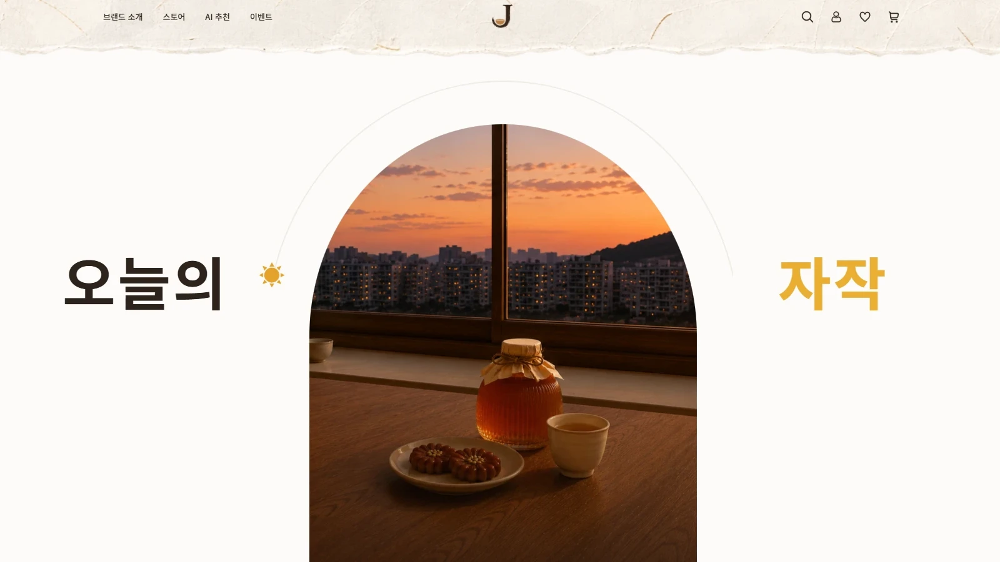
</p>

<p align="center">
  <strong>오늘의 자작</strong><br/>
  사용자의 취향과 오늘의 상황을 바탕으로 전통주 한 상을 제안하는 JAJAK의 메인 화면입니다.
</p>

## 프로젝트 정보

> **AI 기반 전통주 큐레이션 · 반응형 쇼핑몰 · 5인 팀 프로젝트**

| 구분 | 내용 |
| --- | --- |
| 팀명 | 고주망태 |
| 교육기관 | [이젠컴퓨터아카데미 안산교육센터](https://as.ezenac.co.kr/index.asp) |
| 교육과정 | 생성형 AI 기반 UX/UI 디자인 & 프론트엔드 개발 과정 (ChatGPT, Illustrator, Photoshop, Figma, JavaScript, React) |
| 개발기간 | 2026.08.10 ~ 2026.09.09 |
| 발표일 | 2026.09.11 |
| 배포 | [https://jajak-ten.vercel.app/](https://jajak-ten.vercel.app/) |
| GitHub | [https://github.com/jiwoo1012/TeamProject2](https://github.com/jiwoo1012/TeamProject2) |
| PPT | [미리캔버스 바로가기](https://www.miricanvas.com/v2/ko/design2/v/16b50a94-e6a0-48e3-b9c8-fa87f80e460f) |

## 목차

- [기획 배경](#기획-배경)
- [화면 설계](#화면-설계)
- [핵심 기능](#핵심-기능)
- [주요 화면](#주요-화면)
- [AI 추천 흐름](#ai-추천-흐름)
- [기술 스택](#기술-스택)
- [기술적 의사결정](#기술적-의사결정)
- [프로젝트 아키텍처](#프로젝트-아키텍처)
- [Firestore 데이터 구조](#firestore-데이터-구조)
- [트러블슈팅](#트러블슈팅)
- [프로젝트 구조](#프로젝트-구조)
- [협업 방식](#협업-방식)
- [팀 구성 및 역할](#팀-구성-및-역할)
- [팀원별 회고](#팀원별-회고)
- [프로젝트 안내](#프로젝트-안내)

---

## 기획 배경

전통주는 종류와 용어가 다양해 입문자가 맛을 예상하거나 자신에게 맞는 제품을 고르기 어렵습니다. 기존의 카테고리 중심 탐색만으로는 “오늘 혼자 가볍게 마시고 싶다”처럼 구체적인 상황까지 반영하기도 어렵습니다.

JAJAK은 다음 세 가지에 초점을 맞췄습니다.

- **입문 장벽 낮추기**: 복잡한 전문 용어보다 맛과 상황 중심의 질문으로 취향을 파악합니다.
- **상황까지 반영하기**: 평소 취향과 오늘의 기분, 인원, 음식, 분위기를 함께 고려합니다.
- **한 상으로 제안하기**: 술 한 병에 그치지 않고 어울리는 안주와 술잔, 추천 이유까지 제공합니다.

### 주요 사용자

- 전통주를 경험해 보고 싶지만 무엇을 골라야 할지 모르는 20~30대
- 퇴근 후 혼술이나 가벼운 홈술을 즐기는 직장인
- 자신의 취향에 맞는 새로운 술과 페어링을 발견하고 싶은 사용자

---

## 화면 설계

기획 단계에서 사용자 흐름과 기능 간 관계를 먼저 정리한 뒤,
이를 바탕으로 PC·모바일 화면설계와 실제 기능 구현을 진행했습니다.

| 사용자 흐름 | 유스케이스 |
| --- | --- |
| 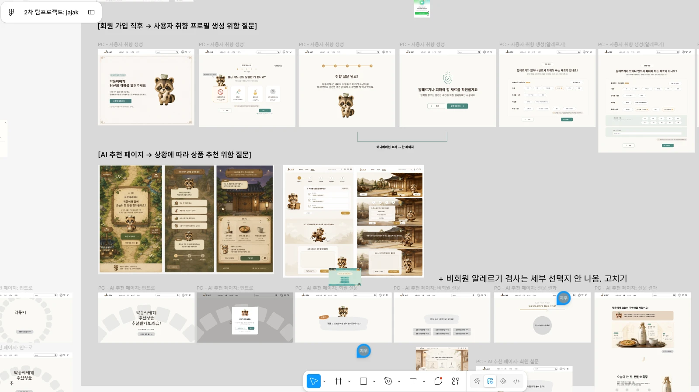 | 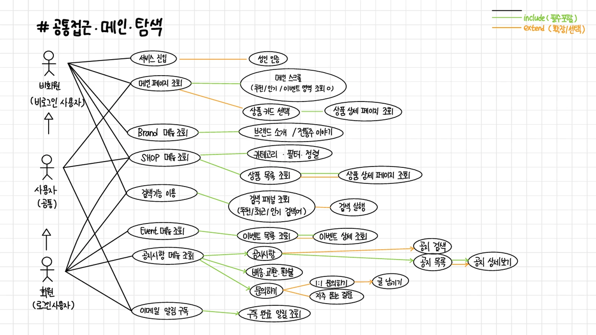 |
| 회원가입 이후 기본 취향 등록부터 AI 추천까지의 주요 흐름을 단계별로 설계 | 비회원·회원·관리자별 주요 기능과 접근 범위를 구분해 기능 간 관계 정의 |

---

## 핵심 기능


### 사용자 기능 흐름

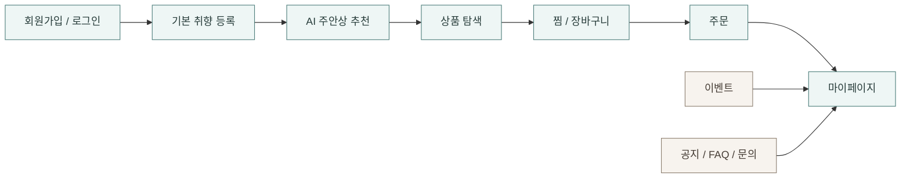

<p align="center">
  <strong>USER</strong> · 회원/취향 · AI 큐레이션 · 상품 탐색 · 찜 · 주문 · 이벤트 · 마이페이지<br/>
  <strong>ADMIN</strong> · 회원 · 상품 · 주문 · 이벤트 · 공지 · 리뷰 관리
</p>

| 영역 | 사용자 경험 | 구현 및 데이터 |
| --- | --- | --- |
| 회원·취향 | 이메일 회원가입·로그인, 가입 후 단계형 취향 등록 | Firebase Authentication, `users/{uid}.userPreference` |
| AI 큐레이션 | 회원·비회원 설문, 전통주·안주·술잔 추천과 추천 이유·회원 추천 저장 제공 | Firebase Callable Functions, OpenAI API, 개발용 Mock 모드 |
| 막동이 주막 | 막동이를 움직여 손님의 요청에 맞는 술·안주·술잔을 고르는 체험 | React 상태 관리, GSAP, 전용 시나리오 데이터 |
| 상품 탐색 | 카테고리, 검색, 상세 필터, 정렬, 페이지네이션, 상품 상세 | Firestore 우선 조회, seed/reference 데이터 보완 |
| 찜·장바구니 | 찜 추가·삭제, 수량 및 선택 상품 관리 | Firestore wishlist, `jajak_cart` localStorage |
| 주문 | 배송지 선택·입력, 포인트 사용, 주문 저장과 주문 상세·취소 | Mock 결제, Firestore `orders` |
| 리뷰 | 구매 상품 리뷰 작성·수정·삭제, 관리자 노출·삭제 관리 | Firestore `reviews` collection |
| 이벤트 | 룰렛, 카드 짝 맞추기, OX 퀴즈, 중복 참여 방지와 결과 확인 | Firestore `events`, `eventParticipations` |
| 마이페이지 | 회원 요약, 프로필·배송지·포인트·주문·찜·AI·이벤트 내역 | Firebase 연동 |
| 고객센터 | 공지 목록·상세, FAQ 검색·분류, 1:1 문의 등록·조회 | Firestore `notices`, `inquiries` |
| 관리자 | 대시보드, 회원·상품·주문·이벤트·공지·리뷰 관리 | Firestore 연동, AI 로그는 시연 데이터 |

---

## 주요 화면

실제 구현 화면을 기준으로 JAJAK의 브랜드 경험부터 AI 큐레이션, 상품 탐색, 사용자 활동 기록, 관리자 운영까지의 흐름을 정리했습니다.

### 브랜드 경험

| 브랜드 스토리 | 막동이 소개 |
| --- | --- |
| 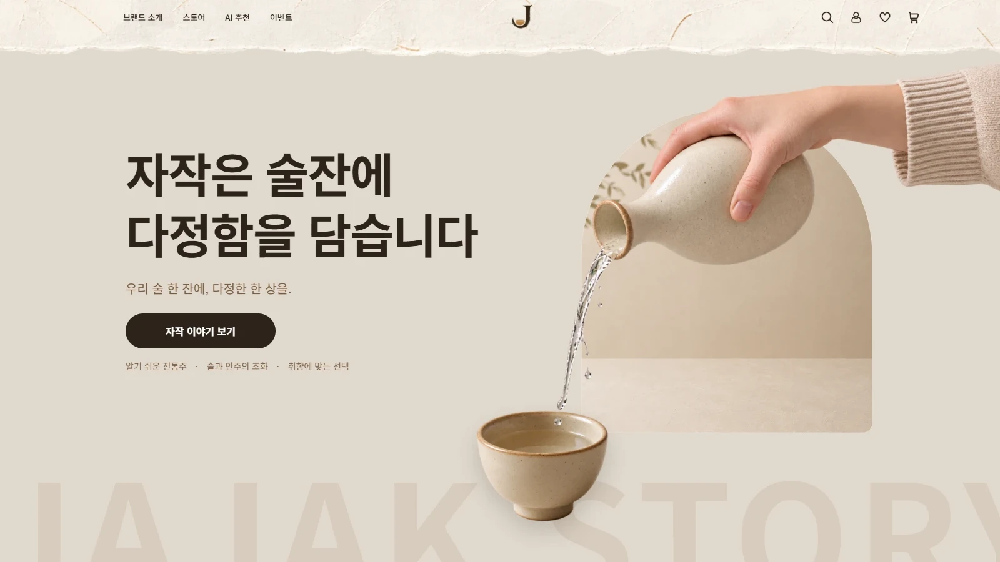 | 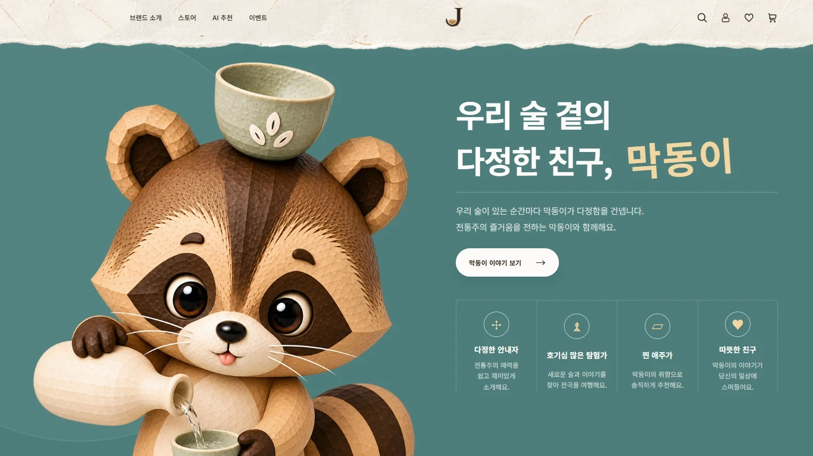 |
| 전통주를 어렵지 않게 소개하는 브랜드 메시지와 시각적 톤 | 취향 등록과 추천 과정을 안내하는 브랜드 캐릭터 **막동이** |

### AI 큐레이션

| 기본 취향 등록 | AI 주안상 추천 결과 |
| --- | --- |
| 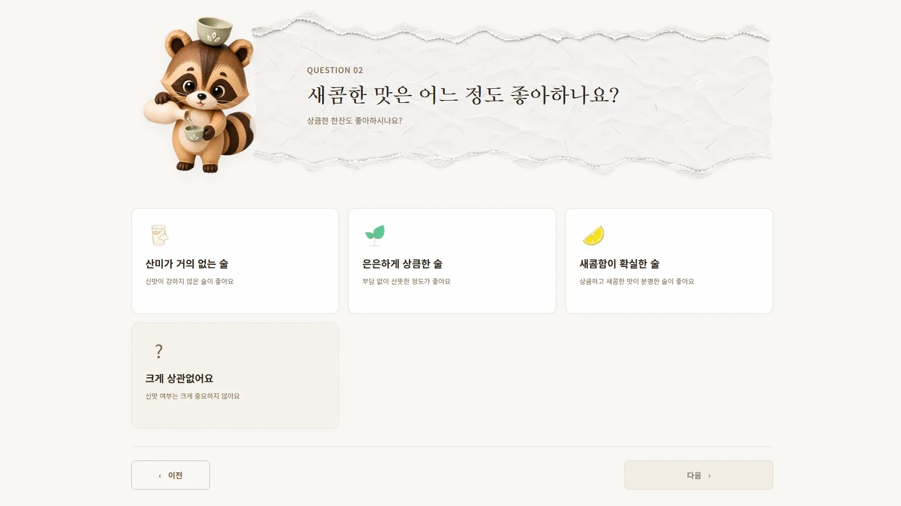 |  |
| 맛과 선호도를 단계별 질문으로 등록 | 전통주·안주·술잔을 하나의 주안상으로 추천하고 추천 이유 제공 |

### 상품 탐색 · 사용자 활동

| 상품 탐색 | 마이페이지 |
| --- | --- |
| 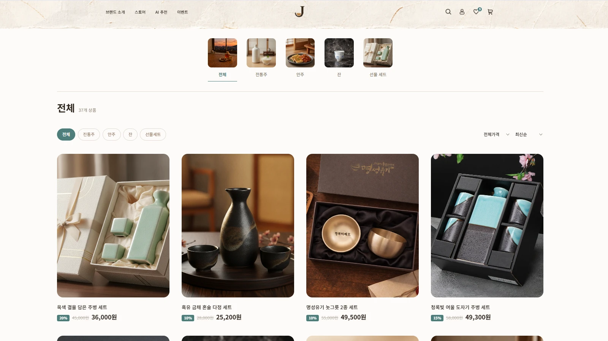 | 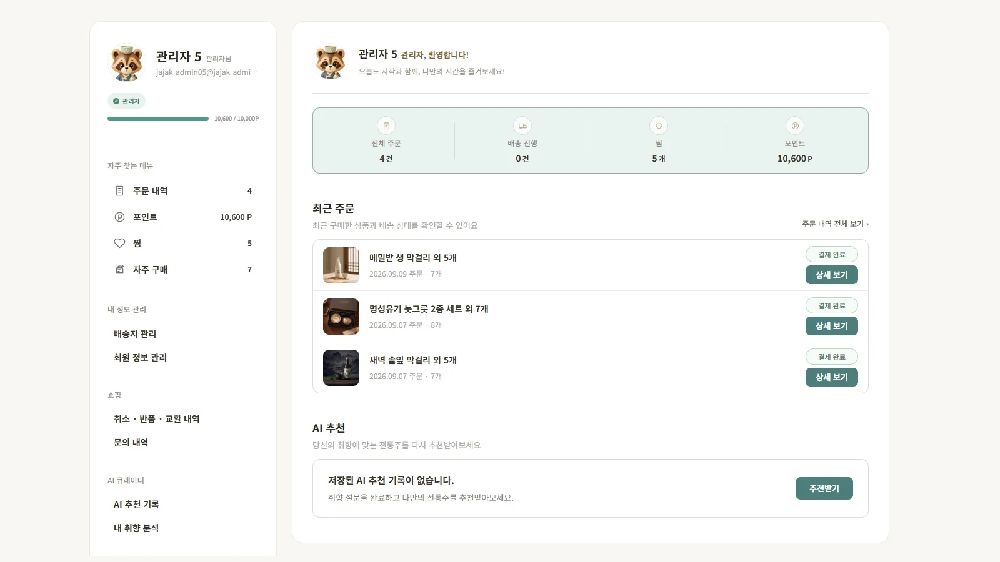 |
| 카테고리·필터·정렬을 활용한 전통주 탐색 | 주문, 찜, 포인트 등 회원 활동을 한 화면에서 확인 |

### 관리자 운영

| 관리자 대시보드 | AI 추천 기록 관리 |
| --- | --- |
| 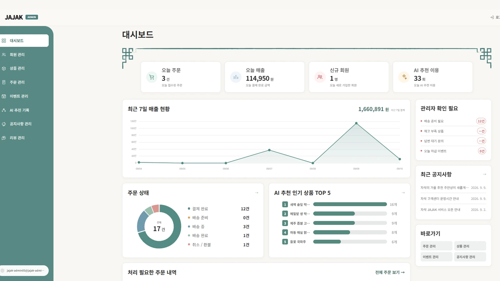 | 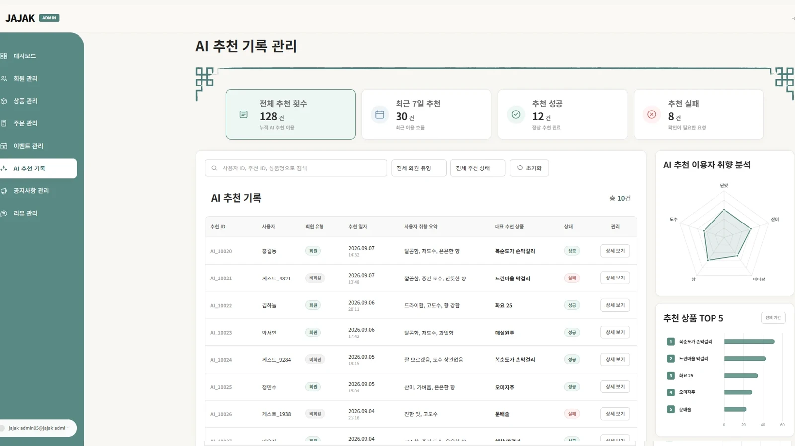 |
| 주문·매출·회원·AI 추천 현황을 차트와 함께 시각화 | 시연용 추천 성공·실패 기록과 사용자 취향, 추천 상품 데이터를 운영 관점에서 확인 |


---

## AI 추천 흐름


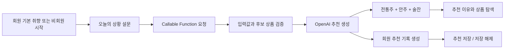

- 회원은 저장된 기본 취향과 오늘의 응답을 함께 사용합니다.
- 비회원은 오늘의 응답만으로 간소화된 추천을 체험합니다.
- OpenAI Secret은 Firebase Functions에서 관리하며 프론트엔드에 노출하지 않습니다.
- 개발 환경에서는 `USE_MOCK_AI=true`로 외부 API 호출 없이 추천 흐름을 점검할 수 있습니다.
- 회원은 추천 결과를 저장하거나 저장 해제할 수 있으며, 상태 변경은 Callable Function에서 처리합니다.

---

## 기술 스택

<p align="center">
  
  
  
  
  
</p>

<p align="center">
  
  
  
  
</p>

<p align="center">
  
  
  
  
</p>

| 구분 | 기술 | 사용 목적 |
| --- | --- | --- |
| Frontend | React 19, JavaScript, Vite, React Router 7 | 컴포넌트 기반 UI, 상태 관리, 라우팅 |
| Styling | Sass, SCSS Modules | 페이지별 스타일 격리와 반응형 UI |
| Interaction | GSAP | 스플래시와 메인 스크롤 인터랙션 |
| Backend | Firebase Authentication, Cloud Firestore, Cloud Functions | 인증, 데이터 저장, 서버 함수 |
| AI | OpenAI API | 설문 기반 주안상 추천 생성 |
| Visualization | Chart.js, react-chartjs-2 | 관리자 데이터 시각화 |
| Deploy / Quality | Vercel, Firebase, Oxlint, Vite build | 배포, 정적 검사, 프로덕션 빌드 검증 |

---

## 기술적 의사결정

> **기술 선택보다 중요한 건 경계를 정하는 것이라고 판단했습니다.**<br>
> 보안, 데이터 일관성, 팀 유지보수를 기준으로 아래 구조를 선택했습니다.

| 결정 | 이유 | 적용 결과 |
| --- | --- | --- |
| OpenAI 호출을 Firebase Cloud Functions 뒤에 배치 | API Key를 프론트엔드에 노출하지 않고, 요청 검증과 회원 추천 기록 저장을 서버에서 처리하기 위해 | 프론트는 Callable Function만 호출하고 OpenAI Secret은 Functions에서 관리 |
| Runtime 상품 기준을 Firestore로 통일 | 가격·재고·판매상태가 화면마다 달라지는 문제를 줄이기 위해 | JSON은 seed/reference 및 표시 보완용으로 제한하고 주문 시점에는 Firestore 데이터를 다시 검증 |
| Cart에는 `productId`, `quantity`만 저장 | 상품 전체 객체를 localStorage에 중복 저장하면 현재 가격·재고와 쉽게 불일치하기 때문에 | `jajak_cart`에는 최소 정보만 저장하고 화면에서 Firestore의 현재 상품 정보와 조합 |
| Route 단위 Code Splitting 적용 | 모든 페이지를 초기 번들에 포함해 첫 진입 청크가 커지는 문제를 줄이기 위해 | `React.lazy`와 `Suspense` 적용 후 초기 JS 청크를 당시 약 1.65MB에서 약 379KB까지 축소 |
| 주요 이미지 WebP 전환 | 많은 상품·캐릭터 이미지가 초기 로딩과 배포 용량에 미치는 영향을 줄이기 위해 | 변환 에셋을 `src/assets/webpImages`에 구성하고 주요 화면의 import 경로를 WebP 기준으로 변경 |

세부 데이터 계약과 보안·협업 규칙은 [AGENTS.md](./AGENTS.md)에서 관리합니다.

---

## 프로젝트 아키텍처

> 프론트엔드 → Firebase → OpenAI까지의 서비스 연결 구조입니다.

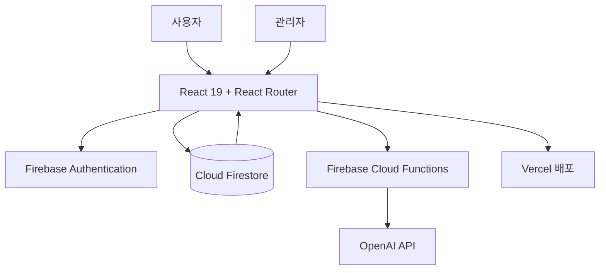

---

## Firestore 데이터 구조

> JAJAK의 주요 문서와 하위 컬렉션 관계를 간략히 시각화했습니다.

관계형 DB의 ERD 대신, 실제 서비스에서 사용하는 주요 Firestore 문서와 연결 관계를 간략히 정리했습니다.

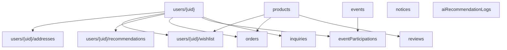

### 주요 데이터 계약

- 상품 Runtime 데이터는 Firestore `products`를 우선 사용하고, 저장소 JSON은 seed/reference 및 일부 표시 보완 데이터로 사용합니다.
- 장바구니는 `localStorage`의 `jajak_cart`에 `[{ productId, quantity }]` 형태로 저장합니다.
- 주문에는 상품명, 가격, 이미지 등 주문 시점의 item snapshot을 보존합니다.
- 회원 정보는 `users/{uid}`, 배송지는 `users/{uid}/addresses`, 찜은 `users/{uid}/wishlist`에서 관리합니다.
- AI 회원 추천 기록은 `users/{uid}/recommendations`에 저장합니다.
- 추천 저장 상태는 `saveJajakRecommendation` Callable Function을 통해 변경합니다.
- 회원·비회원 AI 요청 로그는 `aiRecommendationLogs`에 저장하며 관리자만 조회할 수 있습니다.
- 이벤트 참여는 `eventParticipations/{eventId}_{uid}` 구조로 중복 참여를 방지합니다.
- 회원 권한은 `role: user | admin`, 상태는 `status: active | suspended`를 사용합니다.

## 주요 화면과 경로

| 경로 | 화면 |
| --- | --- |
| `/`, `/intro` | 스플래시와 메인 |
| `/brand`, `/brand/makdong` | 브랜드·막동이 소개 |
| `/preference/*` | 회원 기본 취향 등록 |
| `/ai`, `/ai/survey`, `/ai/result` | AI 주안상 추천 |
| `/ai/tavern` | 막동이 주막 체험 |
| `/shop`, `/shop/:productId` | 상품 목록·상세 |
| `/events`, `/events/*` | 이벤트 목록·룰렛·OX 퀴즈·카드 게임 |
| `/cart`, `/checkout`, `/order-complete` | 장바구니·주문 |
| `/mypage/*` | 회원정보·배송지·포인트·주문·찜·AI 추천·활동 내역 |
| `/notices`, `/faq`, `/inquiry` | 고객센터 |
| `/admin/*` | 관리자 운영 화면 |

---

## 트러블슈팅

사용자에게 나타난 현상에서 출발해 원인을 찾고, 구조를 개선한 뒤 결과를 확인했습니다. 항목을 펼치면 상세한 해결 과정을 볼 수 있습니다.

| 구분 | 발견한 문제 | 핵심 해결 | 결과 |
| :---: | --- | --- | --- |
| 🖼️ **이미지** | 모바일에서 이미지 표시 지연 | PNG 에셋을 WebP로 전환 | 모바일 이미지 로딩 체감 개선 |
| ⚡ **성능** | 초기 JS 번들 약 1.65MB | Route 단위 Code Splitting | 초기 청크 약 **379KB** |
| 🚀 **배포** | Vercel에서 일부 이미지 누락 | 파일명·경로 대소문자 통일 | 로컬·배포 결과 일치 |
| 🔥 **데이터** | 목업과 실데이터 기준 혼재 | Firestore를 Runtime 기준으로 통일 | 가격·재고 불일치 방지 |
| 🛒 **상태** | 선택 주문 후 장바구니 전체 삭제 | 주문한 `productId`만 제거 | 미주문 상품 유지 |

<details open>
<summary><strong>🖼️ 01. 모바일 이미지 로딩 지연 개선</strong></summary>

| 단계 | 내용 |
| --- | --- |
| **문제** | 상품과 캐릭터 이미지가 많은 화면을 모바일에서 처음 열었을 때 이미지가 늦게 표시되어 콘텐츠 영역이 비어 보이거나 화면 완성이 더디게 느껴졌습니다. |
| **원인** | 고해상도 PNG 중심의 이미지 에셋으로 인해 모바일 네트워크에서 내려받아야 하는 데이터가 컸습니다. 상품 목록, 이벤트, AI 추천처럼 여러 이미지를 한 번에 보여주는 화면에서 지연이 더 뚜렷했습니다. |
| **해결** | 상품·캐릭터·이벤트 등 주요 에셋을 WebP로 변환해 `src/assets/webpImages`에 정리했습니다. 컴포넌트와 상품·이벤트 JSON의 이미지 경로도 함께 변경해 실제 화면이 변환된 에셋을 사용하도록 통일했습니다. |
| **결과** | 이미지 품질과 기존 디자인을 유지하면서 브라우저가 내려받는 이미지 용량을 줄였고, 모바일 첫 진입 시 이미지가 표시되는 체감 속도를 개선했습니다. |

</details>

<details>
<summary><strong>⚡ 02. Route 단위 코드 분할로 초기 번들 크기 개선</strong></summary>

| 단계 | 내용 |
| --- | --- |
| **문제** | 상품, AI 추천, 이벤트, 마이페이지, 관리자 화면이 추가되면서 초기 JavaScript 번들이 약 1.65MB까지 커졌고, 첫 진입 때 방문하지 않은 페이지 코드까지 함께 내려받고 있었습니다. |
| **원인** | `App.jsx`에서 대부분의 페이지를 정적으로 import해 모든 Route 코드가 하나의 초기 번들에 포함됐습니다. 화면 수가 늘어날수록 다운로드와 JavaScript 해석 비용도 함께 증가하는 구조였습니다. |
| **해결** | 각 페이지를 `React.lazy`로 불러오고 `Suspense`로 감싸 Route 단위 코드 분할을 적용했습니다. 사용자가 실제로 접근한 화면의 청크만 추가로 내려받도록 변경했습니다. |
| **결과** | 최적화 당시 초기 JS 청크를 약 **1.65MB → 379KB** 수준으로 줄여 첫 화면에 필요한 코드부터 불러오는 구조를 마련했습니다. |

</details>

<details>
<summary><strong>🚀 03. Vercel 배포 환경에서 이미지 누락 해결</strong></summary>

| 단계 | 내용 |
| --- | --- |
| **문제** | 로컬에서는 정상적으로 보이던 일부 이미지가 Vercel 배포 후 표시되지 않아 개발 환경과 배포 환경의 결과가 달랐습니다. |
| **원인** | Windows에서는 지나치기 쉬웠던 실제 파일명과 import 경로의 **대소문자 차이**가 Linux 기반 Vercel 환경에서 서로 다른 경로로 처리됐습니다. |
| **해결** | 배포 로그와 실제 에셋 경로를 비교해 파일명과 모든 import 경로의 대소문자를 정확히 일치시키고 프로덕션 빌드까지 확인했습니다. |
| **결과** | 로컬과 배포 환경에서 동일한 이미지가 표시됐으며, 이미지 경로 변경 시 파일명 규칙을 함께 점검하는 기준을 마련했습니다. |

</details>

<details>
<summary><strong>🔥 04. 목업·localStorage·Firestore 데이터 기준 통일</strong></summary>

| 단계 | 내용 |
| --- | --- |
| **문제** | 화면 확인용 JSON, 장바구니 localStorage, Firestore 상품 데이터가 함께 사용돼 화면의 가격·재고와 주문 시점의 실제 값이 달라질 가능성이 있었습니다. |
| **원인** | UI 구현용 임시 데이터와 계속 유지해야 하는 서비스 데이터의 역할이 명확히 나뉘지 않았습니다. 상품 전체 객체를 여러 저장소에 보관하면 변경 사항이 모든 화면에 함께 반영되지 않을 수 있었습니다. |
| **해결** | Runtime 상품 정보는 Firestore로 통일하고 JSON은 초기 등록과 제한적인 표시 보완용으로 구분했습니다. `jajak_cart`에는 `productId`와 `quantity`만 저장하고 주문 직전에 가격·재고·판매 상태를 다시 검증했습니다. 주문 생성과 포인트 차감은 Firestore Transaction으로 처리했습니다. |
| **결과** | Cart, Checkout, Order가 동일한 상품 기준을 사용하게 되어 오래된 목업 가격이나 재고로 주문되는 상황을 방지했습니다. |

</details>

<details>
<summary><strong>🛒 05. 선택 상품 주문 후 장바구니 전체 삭제 문제</strong></summary>

| 단계 | 내용 |
| --- | --- |
| **문제** | 장바구니에서 일부 상품만 선택해 주문해도 주문 완료 후 선택하지 않은 상품까지 모두 사라졌습니다. |
| **원인** | 주문 성공 후 장바구니 전체를 초기화해 실제 주문 대상과 남겨야 할 상품을 구분하지 못했습니다. localStorage와 Firestore 장바구니 상태도 함께 맞춰야 했습니다. |
| **해결** | 주문 상품의 `productId`를 기준으로 선택 상품만 제외한 `remainingCartItems`를 만들고, 이를 localStorage에 저장한 뒤 Firestore 장바구니와 동기화했습니다. |
| **결과** | 주문한 상품만 제거되고 선택하지 않은 상품은 그대로 유지되며, 새로고침이나 화면 이동 후에도 로컬·원격 장바구니 상태가 일치합니다. |

</details>

### 개발 과정의 추가 개선 기록

| 문제 상황 | 원인과 판단 | 해결 및 결과 |
| --- | --- | --- |
| `INEFFECTIVE_DYNAMIC_IMPORT` 빌드 경고 발생 | `cartStorage`를 정적·동적 방식으로 동시에 불러와 동적 import의 코드 분할 효과가 사라짐 | import 방식을 정적으로 통일해 경고 원인을 제거하고 기존 장바구니 방어 로직을 유지 |
| Sass 색상 함수 중단 예정 경고 발생 | 일부 SCSS에서 향후 제거될 `lighten()`, `darken()` 함수를 사용 | `sass:color` 모듈의 `color.adjust()`로 교체해 최신 Sass 문법에 맞춤 |
| Firebase 공통 청크가 약 553KB로 유지 | Authentication과 Firestore SDK를 여러 사용자 흐름에서 공통으로 사용해 무리하게 분리하면 중복 로딩 가능 | Route 청크를 먼저 줄이고 공통 SDK 청크는 유지했으며, 프로젝트 기준에 맞춰 빌드 경고 한도를 600KB로 조정 |

---

## 프로젝트 구조

```text
TeamProject2/
├─ functions/                 # Firebase Functions와 AI 추천 로직
├─ public/
├─ src/
│  ├─ assets/                 # 브랜드·캐릭터·상품 이미지, 영상과 WebP 변환 에셋
│  ├─ components/             # 공통·관리자·UI 컴포넌트
│  ├─ constants/              # 상태값과 설문 상수
│  ├─ data/                   # 상품 reference JSON과 이벤트 데이터
│  ├─ firebase/               # Auth·Firestore 공통 함수
│  ├─ hooks/                  # 공통 React hooks
│  ├─ pages/                  # 도메인별 페이지
│  ├─ routes/                 # 경로 상수와 접근 제어
│  ├─ services/               # 서비스 연결 로직
│  ├─ styles/                 # 전역 스타일과 디자인 토큰
│  └─ utils/                  # 장바구니·포맷·검증 유틸리티
├─ AGENTS.md                  # 팀 데이터 계약과 협업 규칙
├─ firestore.rules
└─ package.json
```

---

## 협업 방식

- `main`, `dev`에 직접 작업하지 않고 기능별 개인 브랜치에서 개발했습니다.
- 최신 `dev`를 개인 브랜치에 반영하고 Pull Request로 기능을 통합했습니다.
- Figma와 화면설계서를 기준으로 공통 색상, 타이포, 여백, 반응형 규칙을 맞췄습니다.
- 공통 컴포넌트, 담당 경계, Firebase 데이터 계약을 `AGENTS.md`에 기록해 중복 구현과 필드 불일치를 줄였습니다.
- 모바일 화면은 데스크톱을 단순 축소하지 않고 콘텐츠 순서와 배치를 다시 구성했습니다.
- 주요 통합 단계마다 `npm run lint`와 `npm run build`로 정적 검사와 빌드를 확인했습니다.


### 협업 흐름

```mermaid
flowchart LR
    F[Figma / 기능 정의] --> A[AGENTS.md 계약 확인]
    A --> B[개인 브랜치 작업]
    B --> C[Lint / Build 확인]
    C --> D[Pull Request]
    D --> E[dev 통합]
    E --> T[공통 UI / 데이터 충돌 점검]
    T --> M[main 안정 버전]

    classDef plan fill:#f7f3ee,stroke:#8C7E6F,color:#443b33;
    classDef work fill:#eef6f5,stroke:#4D7E7B,color:#263b39;
    classDef release fill:#f2f2f2,stroke:#666,color:#222;
    class F,A plan;
    class B,C,D,E,T work;
    class M release;
```


### 멘토링을 반영한 개선

- 복잡한 가입 단계 대신 **간편한 회원가입 후 단계형 취향 설문**으로 입력 부담을 나눴습니다.
- 기술의 복잡성보다 추천 경험과 UI 완성도에 집중하고, OpenAI API 기반 추천을 현재 구현 범위로 정했습니다.
- 사용자 유즈케이스를 먼저 정리한 뒤 화면설계와 모바일 흐름을 구체화했습니다.
- 이벤트 경험을 보강하기 위해 룰렛에 카드 짝 맞추기와 OX 퀴즈를 추가했습니다.
- 사용자를 AI 추천으로 자연스레 유도하기 위해 막동이 주막 컨텐츠를 추가했습니다.
- 상품, 주문, 회원, 공지, 리뷰, 이벤트 영역을 Firestore와 연결했습니다.

---

## 팀 구성 및 역할

> 각자의 기능 소유 영역을 명확히 나누고, 공통 영역은 연동 경계를 문서화해 협업했습니다.


### 역할 연결 구조

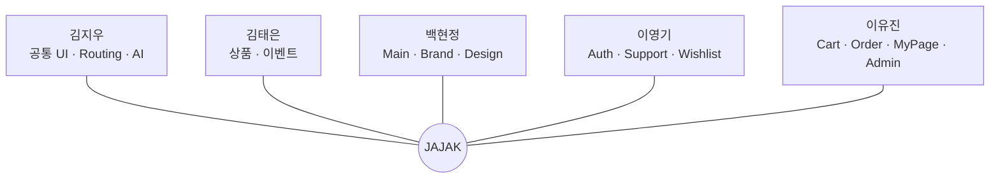

| 팀원 | 담당 영역 | 역할 |
| --- | --- | --- |
| 김지우 | 공통 UI·Routing<br>Preference·AI·통합 | Header·Footer·검색과 전체 Route 관리<br>기본 취향 설문, 회원·비회원 AI 큐레이션과 막동이 주막<br>Cloud Functions·OpenAI·추천 기록·저장 상태 연동<br>관리자 공통 UI와 Dashboard 데이터 집계<br>최종 페이지와 `dev` 통합본 점검 |
| 김태은 | 상품·상품 데이터<br>이벤트·운영 | 상품 Schema·seed/reference·Firestore 연동<br>상품 목록·상세·검색·필터·페어링·리뷰 협업<br>관리자 상품 CRUD와 재고·노출 관리<br>룰렛·카드 게임·OX 퀴즈 및 참여 제한·보상<br>이벤트 참여·당첨 내역과 관리자 이벤트 관리 |
| 백현정 | Main·Brand<br>Dashboard UI·Design | Splash·Journey·Hero·Best Seller와 GSAP 인터랙션<br>브랜드 스토리와 막동이 소개<br>관리자 Dashboard 초기 Layout·차트 UI<br>NotFound 화면과 복귀 동선<br>Figma 디자인 기준 및 타 담당 화면 디자인 보완 |
| 이영기 | Authentication<br>고객센터·Wishlist | 이메일 회원가입·로그인·로그아웃과 회원 초기화<br>로그인 유지·정지 회원 처리·Preference 진입 연결<br>공지·FAQ·1:1 문의와 Firestore 연동<br>Wishlist 조회·삭제·장바구니 이동<br>상품 상세의 인증·찜 기능 협업 |
| 이유진 | Cart·Order·MyPage<br>Admin·Docs | 장바구니·배송지·포인트·Mock 결제·주문 저장<br>주문 내역·상세·취소와 MyPage 회원 관리 화면<br>Admin Layout과 회원·주문·공지·리뷰 관리<br>회원·주문 데이터와 권한·상태 연동<br>AGENTS.md·README 및 공통 데이터 계약 관리 |

### 공동 작업 경계

- 관리자 Dashboard는 백현정이 초기 UI를 구성하고 김지우가 Firestore 집계와 상세 경로를 연결했습니다.
- AdminLayout은 이유진의 기본 구조를 바탕으로 김지우가 공통 UI·Routing·반응형 통합을 보완했습니다.
- ProductDetail은 김태은이 상품·페어링·리뷰 영역을, 이영기가 인증·찜 연동을 중심으로 협업했습니다.
- MyPage는 이유진의 공통 Layout 안에서 김지우의 AI 기록·취향 분석과 김태은의 이벤트 내역을 함께 제공합니다.
- EventList는 김태은의 이벤트 흐름 안에서 김지우의 막동이 주막 바로가기 컴포넌트를 재사용합니다.

---

## 팀원별 회고


### 김지우

이번 프로젝트를 통해 기획부터 디자인, 기능 구현까지 하나의 서비스를 완성해가는 전체 과정을 경험할 수 있었습니다. 팀장으로서 역할을 나누고 팀원들의 진행 상황을 확인하며 Git 병합, 공통 UI, 라우팅처럼 함께 기준을 맞춰야 하는 부분을 조율했습니다. 작업 중 문제가 생겼을 때는 팀원들과 해결 방법을 함께 찾고 전체 일정과 완성도를 맞추는 데 집중했습니다. 그 과정에서 개발 실력뿐만 아니라 협업과 소통, 프로젝트 전체를 바라보고 조율하는 책임감도 배울 수 있었습니다.

### 김태은

이번 프로젝트에서는 상품과 상품 데이터, 이벤트 기능을 중심으로 작업했습니다. 전통주라는 컨셉에 맞는 상품 정보와 카테고리를 구성하고, 상품 탐색과 이벤트 경험이 하나의 서비스 안에서 자연스럽게 이어지도록 구현하는 과정에서 많은 고민이 필요했습니다. 팀원들과 피드백을 주고받으며 디자인과 기능의 균형을 맞추고, 공통 데이터와 다른 기능의 연결 관계를 고려하는 경험을 할 수 있었습니다. 이번 프로젝트를 통해 혼자 기능을 완성하는 것뿐 아니라 다른 담당자의 작업과 맞물리는 부분을 함께 조율하는 것이 중요하다는 점을 배웠습니다.

### 백현정

이번 프로젝트에서는 메인·브랜드 화면과 관리자 대시보드 UI, 전반적인 디자인 정리를 맡아 제각각이던 페이지의 톤을 공통 컴포넌트와 디자인 기준에 맞춰가는 데 집중했습니다. 작업을 진행하며 기능이 정상적으로 동작하더라도 캐릭터의 배치나 그림자, 여백 같은 작은 요소가 서비스 전체의 인상을 크게 바꿀 수 있다는 점을 배웠습니다. 또한 디자인 문제와 에셋 문제, 구현상의 문제를 구분해 원인을 찾는 경험을 통해 무엇이 실제 문제인지 정확하게 짚어내는 것의 중요성을 느낄 수 있었습니다.

### 이영기

이번 프로젝트에서는 로그인·회원가입·고객센터·위시리스트 기능을 담당했습니다. 와이어프레임과 실제 구현을 하나씩 맞춰가는 과정이 쉽지 않았지만, 코드만으로 해결되지 않는 문제도 있다는 것을 경험하며 원인을 정확하게 파악하는 것의 중요성을 느꼈습니다. 특히 인증과 회원 데이터처럼 다른 기능과 연결되는 부분을 작업하면서 담당 기능만 보는 것이 아니라 서비스 전체의 흐름을 함께 고려해야 한다는 점을 배울 수 있었습니다. 팀원들과 도움을 주고받으며 끝까지 기능을 완성할 수 있어 뜻깊은 경험이었습니다.

### 이유진

이번 프로젝트에서는 장바구니와 주문, 마이페이지, 관리자 페이지를 맡아 여러 화면과 데이터를 하나의 흐름으로 연결했습니다. 이 과정에서 목업 데이터와 로컬에 저장할 데이터, Firebase에 연동할 데이터를 구분하고 연결하는 방법을 배울 수 있었습니다. 담당 범위가 넓어 어려움도 있었지만, 팀원들과 기능 경계를 조율하고 문서를 정리하며 협업의 기준을 맞춰가는 과정에서 책임감과 문제 해결 능력을 키울 수 있었습니다. 또한 팀원들이 각자의 역할을 책임지고 진행해 준 덕분에 서로를 믿고 맡은 작업에 집중할 수 있었고, 협업의 장점을 직접 느낄 수 있었습니다.

---

## 프로젝트 안내

> **Portfolio Project**
>
> - 결제와 성인인증은 학습용 **Mock 흐름**으로 구현했습니다.
> - AI는 **OpenAI API 연동 모드**와 개발용 **Mock 모드**를 지원합니다.
> - 관리자 AI 로그 등 일부 화면에는 **시연용 데이터**가 포함되어 있습니다.

## License

본 저장소의 코드와 디자인 결과물은 교육 및 포트폴리오 목적으로 제작되었습니다. 프로젝트에 포함된 이미지, 폰트, 상품 정보 등 외부 자료의 권리는 각 원저작자에게 있습니다.
